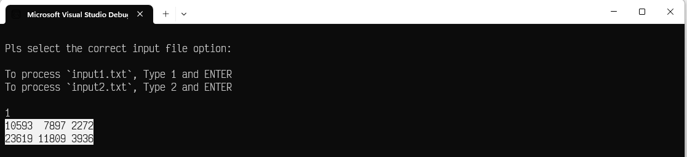
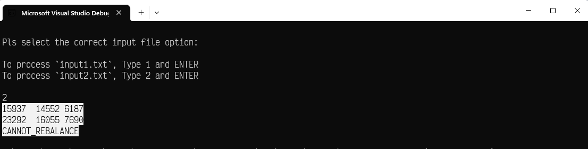

# MyMoney.Demo 

 |  |  | 
| --- | ---          | ---            |  --- |

---------------------------------------

## Repository structure
 
The repository consists of projects as below:

| # |Project Name | Project detail | location| Environment |
| ---| ---  | ---           | ---          | --- |
| 1 | MyMoney.Demo | .Net Core console application  |  **MyMoney.Demo** folder | |
| 2 | MyMoney.Demo.Test | Test for console app |  **MyMoney.Demo.Test** folder | | 

## The Challenge

Portfolio rebalancing is an activity done to reduce the gains from one asset class and investing them in another, to ensure that the desired weight for each asset class doesn't deviate because of market gains/losses.

Your program should take as input:
1. The money allocated in equity, debt and gold funds.
2. Monthly SIP payments.
3. Monthly change rate (loss or growth) for each type of fund.

The output should be
1. Balanced amount of each fund for a certain month.
2. Rebalanced amount of each month if applicable.
Input Commands

There are 5 input commands defined to separate out the actions. Your input format will start with either of these commands i.e ALLOCATE, SIP, CHANGE, BALANCE, REBALANCE

ALLOCATE

The ALLOCATE command receives the initial investment amounts for each fund.

Format - ALLOCATE AMOUNT_EQUITY AMOUNT_DEBT AMOUNT_GOLD
Example- ALLOCATE 6000 3000 1000 means that an amount of 6000, 3000 and 1000 is initially invested in equity, debt and gold fund respectively.

SIP

The SIP command receives the investment amount on a monthly basis for each fund.

Format - SIP AMOUNT_EQUITY AMOUNT_DEBT AMOUNT_GOLD
Example - SIP 2000 1000 500 means a monthly payment of 2000, 1000 and 500 is done against each of equity, debt and gold funds respectivelty.

CHANGE

The CHANGE command receives the monthly rate of change (growth or loss) for each fund type. A negative value represents a loss.

Format - CHANGE AMOUNT_EQUITY AMOUNT_DEBT AMOUNT_GOLD MONTH
Example - CHANGE 8.00% -3.00% 7.00% APRIL means in the month of April equity received a growth of 8%, debt has taken a loss by 3% and gold received a growth of 7%.

BALANCE

The BALANCE command receives a month name.

Format - BALANCE MONTH
Example - BALANCE APRIL means - print the balance for each fund as on April month.

REBALANCE

The REBALANCE command receives no additional inputs.

Input format - REBALANCE
Example - REBALANCE - Rebalance happens compulsorily after 6 months in June and December. The REBALANCE command shows the last rebalanced amount for each fund at the time of rebalancing. If 6 months data is not available then print CANNOT_REBALANCE.

Output format - EQUITY DEBT GOLD
Example - 10593 7898 2273
Assumptions
1. Balances are always floored to the nearest integers.
2. The rebalancing happens on 6th (June) and 12th (December) month.
3. The allocation always happens from January, and SIP from February.

## SAMPLE INPUT-OUTPUT 1

INPUT:

>   ALLOCATE 6000 3000 1000

>   SIP 2000 1000 500

>   CHANGE 4.00% 10.00% 2.00% JANUARY

>   CHANGE -10.00% 40.00% 0.00% FEBRUARY

>   CHANGE 12.50% 12.50% 12.50% MARCH
 
>   CHANGE 8.00% -3.00% 7.00% APRIL
 
>   CHANGE 13.00% 21.00% 10.50% MAY
 
>   CHANGE 10.00% 8.00% -5.00% JUNE
 
>   BALANCE MARCH
 
> REBALANCE

## EXPECTED OUTPUT:

>   10593 7897 2272

>   23619 11809 3936

## ACTUAL OUTPUT

## SAMPLE INPUT-OUTPUT 2

INPUT:

>   ALLOCATE 8000 6000 3500

>   SIP 3000 2000 1000

>   CHANGE 11.00% 9.00% 4.00% JANUARY

>   CHANGE -6.00% 21.00% -3.00% FEBRUARY

>   CHANGE 12.50% 18.00% 12.50% MARCH

>   CHANGE 23.00% -3.00% 7.00% APRIL

>   BALANCE MARCH

>   BALANCE APRIL

>   REBALANCE

## EXPECTED OUTPUT:

>   15937 14552 6187

>   23292 16055 7690

>   CANNOT_REBALANCE

## ACTUAL OUTPUT

Input needs to be read from a text file, and output should be printed to console. Your program should execute and take the location to the test file as parameter.
